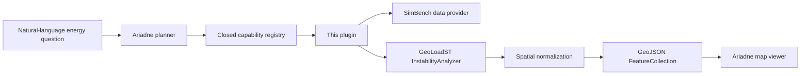

# AriadneThread-GeoLoadST

An open-source research software integration layer for agentic geospatial
energy analytics.

This repository connects **Ariadne Thread** (an agentic geospatial analysis
framework) to **GeoLoadST** (a scientific library for spatial and
spatio-temporal load-instability analysis). It is a plugin, not a merge of
those projects and not a copy of GeoLoadST.

**Initial integration foundation under active development.**

## Architecture

```text
Ariadne Thread
      │
      │ import ariadne_geoloadst
      │   get_capabilities() / analyze()
      ▼
AriadneThread-GeoLoadST   ← this repository
      │
      ▼
GeoLoadST algorithms
```

| Project | Role |
|---|---|
| [Ariadne Thread](https://github.com/AriadneThreadLab/AriadneThread) | Understands questions, plans workflows, orchestrates tools, traces results |
| **AriadneThread-GeoLoadST** | Registers capabilities, validates inputs, translates I/O, records provenance |
| [GeoLoadST](https://github.com/GeoLoadSTLab/geoloadst) | Deterministic scientific calculation |



The plugin may validate, prepare GeoLoadST-compatible input, call the engine,
normalize outputs, attach structured provenance, and emit a GeoJSON
FeatureCollection for Ariadne's existing map viewer. It does **not** implement
RMS, Moran, STV, or topology math, and it does not ship a second map UI.

## Current status

**Initial integration foundation under active development.**

What exists today:

- A closed capability catalog derived from the inspected GeoLoadST API
  (`main` `079dc2cb`, tags `v0.1.0` / `v0.1.1`)
- `GeoLoadSTPlugin.is_available()` so a missing engine does not crash import
- Request validation (unknown ids and undeclared parameters are rejected)
- An adapter that can replay a declared `InstabilityAnalyzer` plan
- Structured scientific provenance (versions, capability, parameters, dataset)
- Spatial normalization to an Ariadne-compatible GeoJSON FeatureCollection
- Public host API: `get_capabilities()` and `analyze(network_id, capability_id, network_data)`
- First host-facing capability: `moran_lisa`
- Offline unit tests that do not call SimBench, GitHub, or other services

What is **not** claimed:

- Full GeoLoadST coverage (some catalog entries remain `declared`, not bound)
- Live SimBench + GeoLoadST end-to-end runs in this repository's CI
- A new map viewer, choropleth renderer, or change to Ariadne's frontend
- A complete energy-analysis product

If GeoLoadST is missing, energy analysis is reported unavailable. Ariadne's
OSM path is unaffected.

## Relationship to Ariadne Thread

Ariadne already has an Indicator Catalog, Tool Registry, and deterministic
OSM analytics. This plugin is the *energy* capability surface Ariadne should
call later through one registered tool. It does not import Ariadne's `app`
package.

A host may select a registered `capability_id`. It may not invent methods or
author scientific formulas.

## Relationship to GeoLoadST

GeoLoadST remains an independent package
([GeoLoadSTLab/geoloadst](https://github.com/GeoLoadSTLab/geoloadst)).
Algorithms stay there. This repository only names bindings such as
`geoloadst.core.instability_index.rms_instability`.

SimBench is treated as a **dataset**, not as Overpass.

See [docs/geoloadst-capabilities.md](docs/geoloadst-capabilities.md) for the
inspected API inventory.

## Scientific language

Results describe **load instability** and its spatial / spatio-temporal
structure. They are not transient, frequency, or protection-system stability.

## Public API for Ariadne

After `pip install -e .` the import name is ``ariadne_geoloadst``:

```python
from ariadne_geoloadst import analyze, get_capabilities

get_capabilities()
analyze(network_id, capability_id, network_data)
```

The first host-facing capability is ``moran_lisa`` (Local Moran LISA via GeoLoadST).
It returns a structured result:

```python
{
    "status": "success",
    "capability": "moran_lisa",
    "statistics": {},
    "features": [],
}
```

Statistics and features are copied from GeoLoadST when the engine completes.
They are empty when the engine did not produce values. This package does not
import Ariadne's ``app`` package and does not reimplement Moran/LISA.

From an Ariadne Thread virtualenv:

```bash
./.venv/bin/pip install -e ../AriadneThread-GeoLoadST
```

## Install

```bash
python3.10 -m venv .venv
./.venv/bin/pip install -e .
./.venv/bin/pip install -e ".[dev]"
```

``pip install -e .`` installs the ``geoloadst`` engine from
``git+https://github.com/GeoLoadSTLab/geoloadst.git@v0.1.1``. The package name
and import path are both ``geoloadst``. Do not pin a local filesystem path.

After install:

```python
import geoloadst
from ariadne_geoloadst import health_status

health_status()
# {"geoloadst_available": True, "version": "...", "capabilities": ["moran_lisa", ...]}
```

Local editable GeoLoadST during joint development:

```bash
./.venv/bin/pip install -e ../geoloadst
```

See [docs/development.md](docs/development.md).

## Documentation

- [Architecture](docs/architecture.md)
- [GeoLoadST capability inventory](docs/geoloadst-capabilities.md)
- [Spatial visualization](docs/spatial-visualization.md)
- [Development setup](docs/development.md)

## Roadmap

1. Foundation: registry, availability, adapter boundary, provenance
2. Spatial GeoJSON export for Ariadne's existing map viewer (this work)
3. Broader binding coverage and fixture-backed SimBench tests
4. Optional Ariadne host integration (domain + tool + `live_data_available` gate)
5. Host-side style that uses severity colour hints

## License

MIT. GeoLoadST and Ariadne Thread keep their own licenses and repositories.
