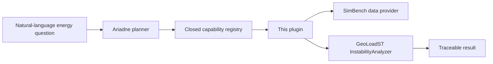

# AriadneThread-GeoLoadST

An open-source research software integration layer for agentic geospatial
energy analytics.

This repository connects **Ariadne Thread** (an agentic geospatial analysis
framework) to **GeoLoadST** (a scientific library for spatial and
spatio-temporal load-instability analysis). It is a plugin, not a merge of
those projects and not a copy of GeoLoadST.

## Architecture

```text
Ariadne Thread
      │
      ▼
AriadneThread-GeoLoadST   ← this repository
      │
      ▼
GeoLoadST
```

| Project | Role |
|---|---|
| [Ariadne Thread](https://github.com/AriadneThreadLab/AriadneThread) | Understands questions, plans workflows, orchestrates tools, traces results |
| **AriadneThread-GeoLoadST** | Registers capabilities, validates inputs, translates I/O, records provenance |
| [GeoLoadST](https://github.com/GeoLoadSTLab/geoloadst) | Deterministic scientific calculation |



## Current status

**Phase 1 — foundation.** The package installs without GeoLoadST. It exposes a
closed capability catalog derived from the real GeoLoadST API, an availability
probe, request validation, and structured provenance. Scientific dispatch to
`InstabilityAnalyzer` is **not** implemented yet (`execute` returns
`not_bound` or `unavailable`).

If GeoLoadST is missing, energy analysis is reported unavailable. Ariadne's
OSM path is unaffected.

## Relationship to Ariadne Thread

Ariadne already has an Indicator Catalog, Tool Registry, and deterministic
OSM analytics. This plugin is the *energy* capability surface Ariadne should
call later through one registered tool. It does not import Ariadne's `app`
package.

## Relationship to GeoLoadST

GeoLoadST remains an independent package
([GeoLoadSTLab/geoloadst](https://github.com/GeoLoadSTLab/geoloadst)).
Algorithms stay there. This repository only names bindings such as
`geoloadst.core.instability_index.rms_instability`.

SimBench is treated as a **dataset**, not as Overpass.

## Scientific language

Results describe **load instability** and its spatial / spatio-temporal
structure. They are not transient, frequency, or protection-system stability.

## Install

```bash
python3.10 -m venv .venv
./.venv/bin/pip install -e ".[dev]"
```

Optional engine (pinned tag, not a local path):

```bash
./.venv/bin/pip install -e ".[scientific]"
```

Local editable GeoLoadST during joint development:

```bash
./.venv/bin/pip install -e ../geoloadst
```

See [docs/development.md](docs/development.md).

## Documentation

- [Architecture](docs/architecture.md)
- [GeoLoadST capability inventory](docs/geoloadst-capabilities.md)
- [Development setup](docs/development.md)

## Roadmap

1. Foundation (this release): registry, availability, provenance
2. Bind GeoLoadST analyzer methods and normalize outputs
3. SimBench provider tests on fixtures
4. Optional Ariadne host integration (domain + tool)
5. Map/report presentation of bus-level results

## License

MIT. GeoLoadST and Ariadne Thread keep their own licenses and repositories.
