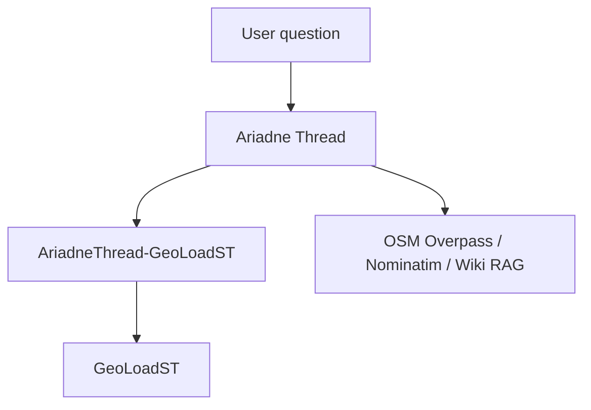

# AriadneThread-GeoLoadST architecture

This repository is the **integration plugin** between two independent research
projects. It is not a merge of those projects and it does not contain a copy of
GeoLoadST.

Inspected hosts (2026-09-05):

- Ariadne Thread local tree `~/projects/osm-geoagent` (public:
  [AriadneThreadLab/AriadneThread](https://github.com/AriadneThreadLab/AriadneThread))
- GeoLoadST `main` at `079dc2cb` and release tags `v0.1.0`, `v0.1.1`
  ([GeoLoadSTLab/geoloadst](https://github.com/GeoLoadSTLab/geoloadst))

## 1. Relationship between the three repositories



| Repository | Responsibility |
|---|---|
| **Ariadne Thread** | Natural-language planning, Tool Registry, OSM retrieval, indicator selection for geographic OSM questions, trace/UI, HTTP service |
| **AriadneThread-GeoLoadST** | Capability registry, input/output translation, availability/version checks, SimBench *provider* wrapper, structured provenance |
| **GeoLoadST** | Deterministic spatial / spatio-temporal load-instability science (`InstabilityAnalyzer` and `geoloadst.core`) |

Dependency direction is one-way:

```
AriadneThread  →  import ariadne_geoloadst  →  AriadneThread-GeoLoadST  →  GeoLoadST
```

Ariadne calls the public functions `get_capabilities()` and
`analyze(network_id, capability_id, network_data)`. The first host-facing
capability is `moran_lisa` (catalog id `lisa_instability`).

This package **must not** import Ariadne's `app` package. Ariadne installs this
package (`pip install -e .`) and imports it. GeoLoadST remains independently
versioned.

## 2. Responsibility boundaries

**Ariadne may** interpret the question, choose a registered `capability_id`,
choose a supported SimBench network code (or another future energy provider),
and explain a result that already exists.

**Ariadne may not** invent GeoLoadST methods, author formulas, compute Moran /
STV / RMS itself, or call arbitrary Python.

**This plugin may** validate the chosen id, check that GeoLoadST is installed
and compatible, translate host data into GeoLoadST inputs, and normalize
outputs plus provenance.

**This plugin may not** reimplement `rms_instability`, Moran, STV, or topology
metrics.

**GeoLoadST may** compute on a `pandapowerNet`, coordinates, and load profiles.

**SimBench** is a **data source**, not an analysis engine and not an OSM query
API.

## 3. Current Ariadne architecture this plugin must reuse

Ariadne already has a closed scientific stack. Do **not** add a second
metric catalog inside Ariadne for energy.

| Ariadne concept | Role today | Plugin relationship |
|---|---|---|
| Indicator Catalog (`app/indicators`) | YAML `indicator_id` → `method_id` | **EXTEND later** with `energy_grid` domain entries that *bind* to plugin capability ids |
| Method registry (`app/analytics/methods`) | Closed OSM computations | **NOT NEEDED** for GeoLoadST math |
| Metric Catalog | Count, density, coverage, … | **REUSE** only if a later mapping to UI comparison widgets is useful |
| Tool Registry | Only registered tools run | **EXTEND** with `analyze_energy_grid`, which calls `analyze()` |
| Data requirement planner | OSM tags + place_ref | **EXTEND** with energy requirement kinds from this catalog |
| Comparison executor | OSM multi-target indicators | **REUSE** orchestration style; do not put pandapower inside it |
| `AnalysisDecisionTrace` | Domain, candidates, selected indicator | **EXTEND** with plugin provenance fields |
| OSM RAG / Overpass | Geographic features | **NOT NEEDED** as the SimBench loader |

REUSE / EXTEND / NEW / NOT NEEDED (summary):

- **REUSE:** closed-id selection, Tool Registry gate, structured traces, optional extras pattern, no import-time network.
- **EXTEND (in Ariadne, later):** domain literal `energy_grid`, one registered tool, decision-trace fields, UI report sections.
- **NEW (this repo):** capability YAML, `GeoLoadSTPlugin`, SimBench provider facade, version probe.
- **NOT NEEDED:** vendored GeoLoadST, a second Overpass client, LangChain, a workflow orchestrator, hardcoded `~/projects/geoloadst`.

## 4. Current GeoLoadST architecture

Public surface (`geoloadst/__init__.py`):

```text
InstabilityAnalyzer
__version__ = "0.1.0"
```

High-level methods on `InstabilityAnalyzer` (from `geoloadst/api.py`):

- `prepare_data`
- `compute_spatiotemporal_instability`
- `compute_directional_variograms`
- `compute_local_anisotropy`
- `compute_multidim_instability`
- `compute_moran_analysis`
- `run_industrial_daynight_scenario`
- `compute_topology_analysis`
- `run_full_workflow`
- `get_summary`

I/O (`geoloadst.io`): `load_simbench_network`, `extract_bus_coordinates`,
`build_bus_load_timeseries`, `select_roi_buses`.

Core modules and scenario helpers are inventoried in
[geoloadst-capabilities.md](geoloadst-capabilities.md).

`pyproject.toml` already declares `pandapower`, `simbench`, `numpy`, `pandas`,
`scipy`, `scikit-learn`, `scikit-gstat`, `libpysal`, `esda`, and `networkx`.
This plugin does **not** repeat those pins unless a host-only helper needs them.

## 5. Plugin architecture

```
src/ariadne_geoloadst/
  schemas.py          closed Pydantic contracts
  data/capabilities.yaml
  capabilities.py     catalog loader + CapabilityRegistry
  registry.py         compatibility alias
  compatibility.py    is_available / version range
  adapter.py          GeoLoadSTPlugin (validate, dispatch, provenance)
  engine.py           lazy InstabilityAnalyzer binding
  normalization.py    JSON-safe reshape of engine outputs
  provenance.py       structured metadata
  simbench.py         data-provider facade
  geometry.py         electrical model → SpatialNetwork
  visualization.py    SpatialNetwork + outputs → GeoJSON
```

`GeoLoadSTPlugin.is_available()` distinguishes:

| Status | Meaning |
|---|---|
| `available` | Importable, version in range, scientific imports present |
| `package_missing` | `geoloadst` not installed |
| `incompatible_version` | Installed version outside `>=0.1.0,<0.2.0` |
| `optional_dependency_missing` | Engine present but e.g. `simbench` missing |

Application startup of Ariadne must not fail on `package_missing`.

`execute()` validates the capability, then:

| Status | Meaning |
|---|---|
| `unavailable` | GeoLoadST (or a required scientific extra) is missing |
| `not_bound` | Catalogued, but no `InstabilityAnalyzer` plan yet |
| `rejected` | Required SimBench-backed inputs are missing |
| `engine_error` | GeoLoadST raised; the original error is chained |
| `completed` | Engine ran; outputs are normalized engine values plus optional GeoJSON |

This is the **initial integration foundation**. It is not a complete
energy-analysis product.

## 6. Capability registry design

The catalog is the only place a `capability_id` becomes real. Schema fields
mirror Ariadne indicators where the concepts already exist:

- `capability_id` ↔ `indicator_id`
- `domain` (`energy_grid`)
- `analytical_goal` ↔ Indicator `goals`
- `required_data` ↔ Indicator `requirements`
- `geoloadst_binding` ↔ `method_id` / `implementation_id`
- `limitations`, `parameters`, `prerequisites`

The LLM may propose an id. `CapabilityRegistry.validate_request` rejects
unknown ids and undeclared parameter names.

Later, Ariadne's Indicator Catalog should *reference* these ids rather than
growing a parallel energy YAML tree inside `osm-geoagent`.

## 7. Data flow

```
User question
      ↓
Ariadne planner (intent / domain)
      ↓
Select registered capability_id
      ↓
Energy data requirement
      ↓
SimBench provider (network code, optional ROI, time window)
      ↓
Canonical input {net | load_df, coords, bus_ids}
      ↓
GeoLoadSTPlugin.validate → GeoLoadST InstabilityAnalyzer
      ↓
Normalized scalars + GeoJSON FeatureCollection + provenance
      ↓
Ariadne AnalysisBlock / AgentQueryResponse.geojson / existing map viewer
```

OSM Overpass stays on the geographic-feature path. It is not used to invent
SimBench buses.

## 8. SimBench integration strategy

Reuse GeoLoadST:

```python
from geoloadst.io import load_simbench_network, extract_bus_coordinates, build_bus_load_timeseries
```

AriadneThread-GeoLoadST adds only discovery/provenance (network code, ROI
bbox, time window, attribution). It does not wrap Overpass semantics around
SimBench.

Limitations to keep explicit:

- A SimBench code is not “the power network of an arbitrary city”.
- ROI is a bbox on the case coordinates (`xmin, xmax, ymin, ymax`).
- Subsetting (`max_buses`, `max_times`, `max_pairs`) changes the analysed
  population; traces must record those bounds.
- Networks without `net.profiles["load"]` are rejected by GeoLoadST.

## 9. Deterministic execution flow (target)

1. Host detects energy-grid intent.
2. Host lists candidate capability ids from this registry.
3. Selected id is validated.
4. Data provider loads SimBench (or a future provider) once.
5. Plugin dispatches to a documented `geoloadst` callable.
6. Outputs are converted to JSON-serialisable tables / optional GeoJSON points
   (buses), never model-authored numbers.
7. Provenance is attached; hidden reasoning is not.

## 10. Traceability

Provenance recorded by this plugin (no chain-of-thought):

- plugin id / plugin version / adapter version
- capability id, kind, goal, binding
- selection reason (short structured string from the host)
- GeoLoadST version and compatibility range
- availability status
- dataset id / SimBench network code
- parameters
- required-data list
- catalog limitations

Ariadne should copy these into `analysis.decision_trace` and the Comparison
Report without dumping GeoLoadST internals (`NetworkX.Graph` objects, raw
`libpysal` weights).

## 11. Dependency strategy

| Context | Command |
|---|---|
| Plugin + engine | `pip install -e .` (installs `geoloadst` from the pinned GitHub tag) |
| Local science development | `pip install -e .` and `pip install -e ../geoloadst` |
| Alias | `pip install -e ".[scientific]"` (same `geoloadst` pin) |

Do not put a machine-local path in `pyproject.toml`.

The package name and import path are both `geoloadst`. The plugin still
imports that engine lazily so listing capabilities does not load it.

## 12. Version compatibility

- Plugin version: `0.1.0`
- Adapter version: `adapter-1`
- Capability catalog: `geoloadst-capabilities-1`
- Supported engine: GeoLoadST `>=0.1.0,<0.2.0` (covers tags `v0.1.0` and `v0.1.1`)

A 0.2 public-API break should bump the range after the adapter is reviewed.

## 13. LLM responsibility boundary

Allowed: interpret “are unstable nodes clustered?”, pick
`spatial_clustering_of_instability` or `global_moran_instability` /
`lisa_instability`, explain Moran I and LISA codes.

Forbidden: invent `transient_stability_index`, compute I, or fill missing
load profiles.

## 14. Scientific limitations

GeoLoadST computes **load-instability** and **spatial/spatio-temporal
structure of load**. Results must not be presented as:

- transient / frequency / rotor-angle stability
- protection-system security
- universal grid stability
- Rate of Change of Frequency (RoCoF); RoCoL is load-rate-of-change

Voltage features exist only as optional arguments on
`build_instability_features`; `InstabilityAnalyzer.compute_multidim_instability`
does not pass them. They are not a registered first-class capability.

## 15. Testing strategy

Offline unit tests (this repo):

- import and `is_available()` without GeoLoadST
- catalog discovery and unknown-id rejection
- undeclared parameter rejection
- provenance shape (no chain-of-thought)
- adapter contract against a fake `InstabilityAnalyzer`
- SimBench-is-not-Overpass wording

Later phases:

- adapter output normalization against a tiny fixture net (no live download
  if a fixture can be committed or synthesized)
- deterministic repeatability of RMS / Moran given a fixture
- Ariadne host tests that OSM paths stay green when this extra is absent

## 16. Future extension

The same plugin interface can host a second scientific engine later
(`AnalysisPlugin` protocol: `is_available`, `registry`, `execute`). Keep
engines out of Ariadne core.

## 17. Phased implementation roadmap

| Phase | Work | Status |
|---|---|---|
| 1 | Repository, catalog, availability, provenance, docs | done |
| 2 | Bind `InstabilityAnalyzer` plans; normalize outputs | **initial foundation** |
| 3 | SimBench load via GeoLoadST I/O + fixture tests | not started |
| 4 | Ariadne optional extra, `energy_grid` domain, one Tool Registry tool | not started |
| 5 | UI report / map of bus points + limitations | not started |

Current public status: **Initial integration foundation under active development.**

## 18. Repository creation and local setup

See [development.md](development.md). Do not push a GitHub remote from this
phase; the remote is attached manually.
